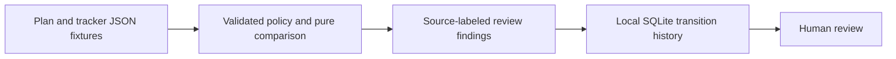

# Milestone Reconciliation Monitor

Compare a delivery plan with a tracker snapshot and surface drift for human review, without changing either source.

[](https://github.com/prashobnair/milestone-reconciliation-monitor/actions/workflows/ci.yml) [](https://github.com/prashobnair/milestone-reconciliation-monitor/actions/runs/36328272975)   

## The problem

In a fictional Marigold Labs rollout, a PM's approved plan says data load is due on one day, while the tracker says another. The tracker record has gone stale, and its incomplete status only says `notcompleted`. Someone needs to review the discrepancy without mistaking a timezone representation for drift, silently picking a winning date, or getting a new alert simply because a stale record is one day older.

## What it does

- Compares versioned plan and tracker snapshots with timezone-aware timestamps and source-labeled findings.
- Flags stale data, due-date and owner mismatches, and status differences that are not allowed by local policy.
- Maps a fictional Zoho Projects-shaped portfolio export to the same review format. `notcompleted` stays `open_unknown`, not an invented project phase.
- Stores local SQLite finding transitions (`opened`, `aged`, `changed`, `resolved`, `reopened`). Age-only updates retain history without repeated digest eligibility until the next configured band; **no notification is sent**.

## Quickstart (offline)

Requires Python 3.11–3.13 and [uv](https://docs.astral.sh/uv/). No vendor trial, credential or Docker setup is needed. From the repo root:

```sh
uv sync --locked --group dev
uv run python -m milestone_monitor.cli examples/drift.json
uv run python -m milestone_monitor.zoho_sample examples/zoho-shaped-portfolio.json
```

The first sample has four review findings across three milestones, including a stale tracker record, due-date mismatch and status mismatch for data load, plus a launch owner mismatch. The portfolio sample has a drifted Marigold Labs project and an aligned Indigo project. To see the local ledger, run `uv run python -m milestone_monitor.state_cli /tmp/milestone-review.sqlite examples/drift.json` twice: the second run is unchanged. See [state semantics](docs/STATE.md) and the [Zoho-shaped fixture notes](docs/ZOHO_SAMPLE.md). Tests: `uv run pytest`.

## How it works



The default [policy](policy.yaml) keeps a seven-day stale threshold, 7/14/30-day age bands, and compatibility between `open_unknown` and a plan's `planned` or `in_progress` status. Pass a JSON-compatible policy file with `--policy` to the snapshot or state CLI. Invalid fields or rules fail closed before a ledger write. The Zoho-shaped importer demonstrates the default policy only. The [golden output fixtures](tests/golden/) catch unintended default-output changes; see [ADR 0001](docs/adr/0001-policy-as-config.md), [API contracts](docs/API_CONTRACTS.md), and the [threat model](docs/THREAT_MODEL.md).

## Scope & safety

> This is an offline prototype using fictional inputs. It has no live Zoho connection, scheduler, API server, recipient list or send path. `digest_eligible` is review metadata, not permission to message anyone. Do not use customer or employer records or commit a local SQLite database. The example stale threshold is not a vendor SLA.

CI runs Ruff, strict mypy, Python 3.11–3.13 tests with 80% overall and 90% core branch-coverage gates, Bandit, pip-audit and gitleaks, and uploads synthetic JSON demo artifacts. A tag-triggered workflow is set to attach wheel and source distribution to a GitHub Release after the maintainer publishes a tag. See [CONTRIBUTING.md](CONTRIBUTING.md), [SECURITY.md](SECURITY.md), [CHANGELOG.md](CHANGELOG.md), and the [MIT license](LICENSE).
